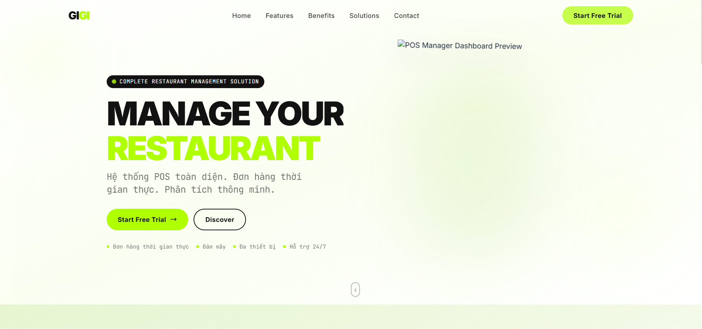
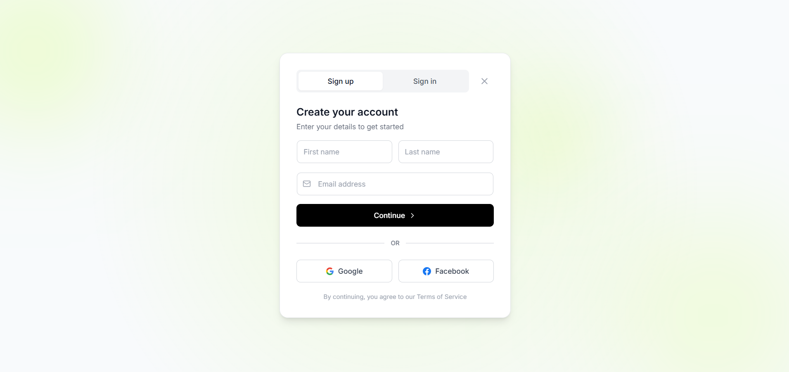
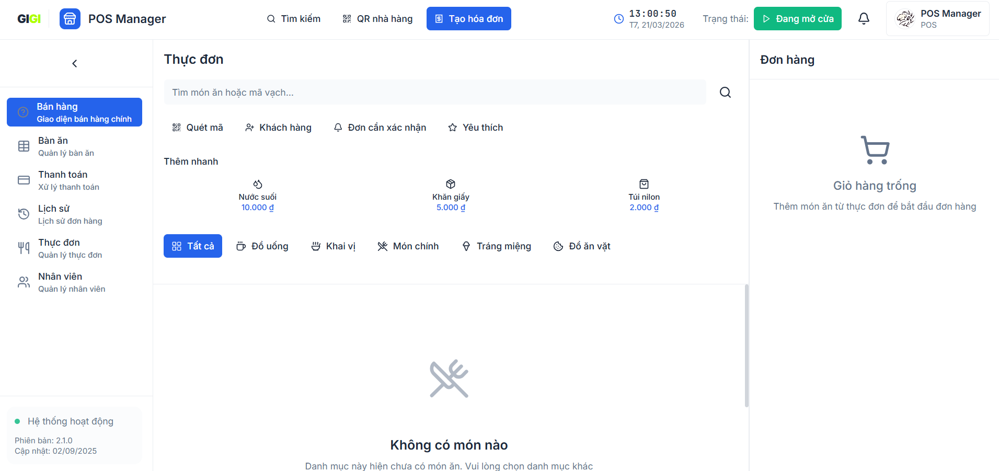
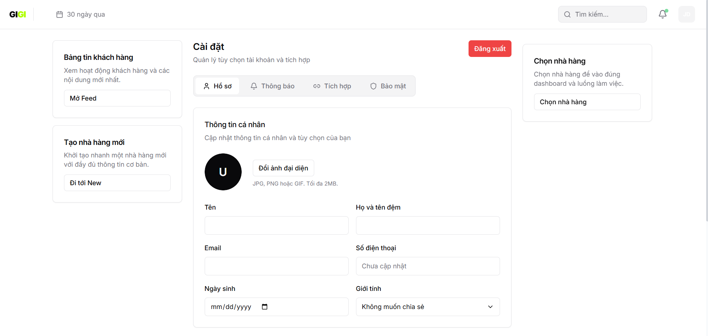
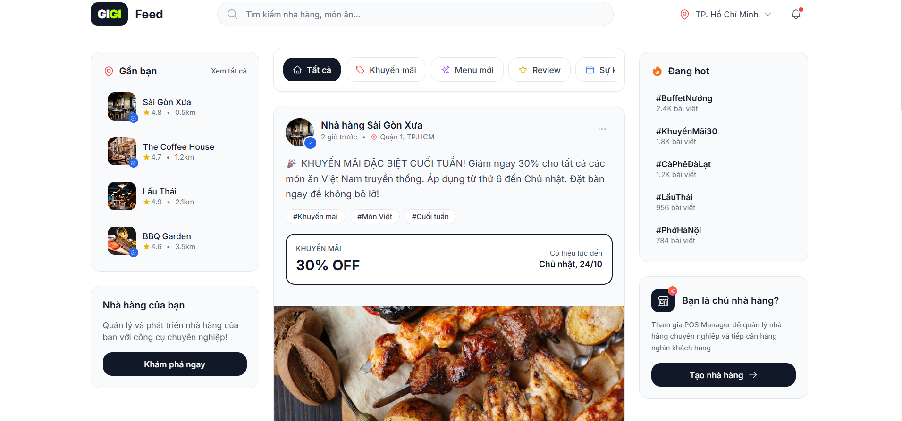

<div align="center">


# Multi-Restaurant Manager UI
**Hệ thống quản lý nhà hàng thế hệ mới**

[](https://react.dev)
[](https://vitejs.dev)
[](https://tailwindcss.com)

[Tính năng](#tính-năng) · [Cài đặt](#cài-đặt) · [Kiến trúc](#kiến-trúc) · [API](#api)


</div>

---

## Giới thiệu

Multi-Restaurant Manager là giải pháp quản lý nhà hàng toàn diện, hỗ trợ real-time cho mọi nghiệp vụ từ bán hàng, quản lý bàn, thực đơn, nhân viên đến thanh toán và báo cáo.

## Demo

<div align="center">
  
  
  
  
  
</div>

## Tính năng

### Bán hàng (POS)
- Giao diện bán hàng tối ưu, real-time
- Giỏ hàng thông minh với tính toán tự động
- Hỗ trợ đơn hàng draft từ khách hàng tự order

### Quản lý thực đơn
- CRUD món ăn với phân loại danh mục
- Theo dõi tình trạng kho (available / low_stock / unavailable)
- Bulk actions, view mode Table & Grid

### Quản lý bàn
- Sơ đồ tầng trực quan với drag & drop
- Trạng thái real-time (available / occupied / reserved / cleaning)
- Gộp bàn, tạo đơn từ bàn

### Quản lý nhân viên
- Phân quyền theo vai trò (owner, manager, cashier, kitchen, waiter)
- Theo dõi ca làm việc và hiệu suất

### Thanh toán
- Đa phương thức: Tiền mặt, Thẻ, MoMo, ZaloPay, QR Banking
- Quy trình wizard 4 bước

### Báo cáo & Phân tích
- Dashboard tổng quan doanh thu
- Biểu đồ trực quan với Recharts
- Lịch sử đơn hàng với filter nâng cao

### Khách hàng tự order
- Menu browsing qua QR code
- Gửi draft order về bếp

## Tech Stack

| Layer | Công nghệ |
|-------|-----------|
| **Core** | React 18, Vite 5, React Router 6 |
| **State** | Zustand (persist middleware) |
| **Styling** | TailwindCSS, Framer Motion |
| **UI** | Radix UI, Lucide Icons |
| **Data** | Axios, EventSource (SSE) |
| **Charts** | Recharts |
| **DnD** | @dnd-kit |

## Cài đặt

```bash
# Clone
git clone https://github.com/dinhdev-nu/restaurant-manager-saas-ui.git
cd pos_manager

# Install
npm install

# Config
cp .env.example .env
# Edit .env với VITE_SERVER_BASE_URL và VITE_API_URL

# Run
npm start
```

**Scripts:**
- `npm start` - Development server
- `npm run build` - Production build
- `npm run serve` - Preview build

## Kiến trúc

```
src/
├── api/          # Axios instances & API calls
├── components/   # Shared UI components
├── contexts/     # React Context (SSE)
├── hooks/        # Custom hooks
├── pages/        # Feature-based pages
├── services/     # Business logic (OAuth, Token refresh)
├── stores/       # Zustand stores
└── utils/        # Helpers & formatters
```

### State Management

8 Zustand stores với persist:

| Store | Mục đích |
|-------|----------|
| `auth` | Authentication state |
| `restaurant` | Restaurant selection |
| `menu` | Menu items & categories |
| `table` | Tables & floor layout |
| `staff` | Employee management |
| `order` | Order history |
| `customer-order` | Customer draft orders |
| `notification` | In-app notifications |

### Real-time (SSE)

Events được stream qua `/events/stream`:
- `new_draft_order` - Khách gửi draft
- `new-order` / `new_order_confirmed` - Order lifecycle
- `table-update` / `payment-update` - Status changes

## API

**Hai Axios instances:**
- `CallApi` - Public endpoints
- `CallApiWithAuth` - Protected endpoints (JWT Bearer)

**Endpoints chính:**

| Category | Examples |
|----------|----------|
| Auth | `/auths/login`, `/auths/register`, `/auths/verify-otp` |
| User | `/users/me` |
| Restaurant | `/restaurants`, `/restaurants/:id/menu-items`, `/restaurants/:id/tables` |
| Orders | `/orders`, `/orders/drafts`, `/orders/:id/checkout` |
| Payments | `/payments/cash`, `/payments/qr` |

## Routes

| Route | Mô tả | Protection |
|-------|-------|------------|
| `/` | Landing page | Public |
| `/auth` | Sign in / Sign up | Public |
| `/main-pos-dashboard` | POS bán hàng | Restaurant |
| `/menu-management` | Quản lý thực đơn | Restaurant |
| `/table-management` | Quản lý bàn | Restaurant |
| `/staff-management` | Quản lý nhân viên | Restaurant |
| `/order-history` | Lịch sử đơn hàng | Restaurant |
| `/payment-processing` | Thanh toán | Restaurant |
| `/analysis-reporting` | Báo cáo | Restaurant |
| `/order/:restaurantId` | Khách tự order | Protected |

## Authentication

**Flows hỗ trợ:**
- Email/Password + OTP verification
- Google OAuth2
- 2FA (optional)

**Token management:**
- Access token: Zustand (localStorage)
- Refresh token: httpOnly cookie
- Auto refresh on 401

## Environment

```env
VITE_SERVER_BASE_URL=http://localhost:3000
VITE_API_URL=http://localhost:3000
```

## License

Private & Proprietary

---

<div align="center">

**[Dinh Dev](https://github.com/dinhdev-nu)**

</div>
